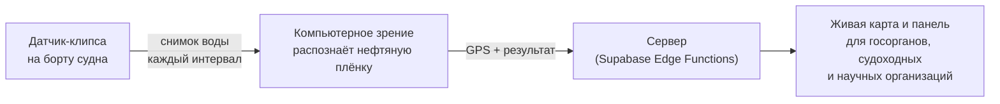

<div align="center">

# Catchy

**Море предупреждает первым**

Сеть компактных датчиков на судах, которая замечает нефтяное пятно раньше, чем это сделает человек.

[Живая версия](https://catchy-eta.vercel.app) · [Caspian Hackathon 2026](#хакатон)


</div>

---

## Проблема

Через Каспий ежедневно проходят сотни судов — ни одно из них сегодня не сообщает, если оставляет за собой нефтяной след. О разливах узнают постфактум, когда пятно кто-то случайно заметил: системного, распределённого мониторинга загрязнений вдоль судоходных маршрутов не существует.

Ситуацию усугубляет контекст: уровень Каспия упал до минимума за 400 лет (в казахстанском секторе — около −29,3 м в 2025 году, хуже всего у восточного побережья, то есть у Мангистау). На фоне обмеления любое дополнительное загрязнение сильнее бьёт по каспийскому тюленю и осетровым.

## Решение

**Catchy** — сеть датчиков-клипс, которые крепятся на любое судно и превращают существующий судоходный трафик в распределённую сеть экологического мониторинга — без отдельного флота или инфраструктуры.



1. Датчик фотографирует поверхность воды с заданным интервалом.
2. Модель компьютерного зрения проверяет снимок на признаки нефтяной плёнки.
3. При обнаружении — фиксируются точные GPS-координаты, данные уходят на сервер.
4. Дашборд показывает карту накоплений, зоны риска, историю обнаружений и алерты по порогу загрязнения.

Сеть мониторинга растёт вместе с числом подключённых судов.

## Кому это нужно

Госорганы и экослужбы → судоходные и нефтедобывающие компании (комплаенс, раннее предупреждение) → научные организации → НКО и общественный контроль.

## Демо-режим

Физического датчика ещё нет — прототип целиком демонстрирует продукт программно. `src/fleet.ts` моделирует восемь судов реальными курсами и скоростями в патрульной зоне у Актау и одно дрейфующее нефтяное пятно; показание каждого судна — функция его текущей позиции относительно пятна плюс шум. Состояния судна (`clear` → `sheen` → `review`) возникают из этой модели, а не задаются вручную — демо ведёт себя так, как повёл бы себя настоящий продукт: направьте «чистое» судно в пятно на панели, и его показание само дойдёт до превышения порога.

Использование демонстрационных данных вместо реального железа соответствует условиям хакатона (тестовые/демо-данные допустимы, если честно обозначены) — интерфейс так и подписывает этот режим.

## Технологии

| Слой | Технологии |
| --- | --- |
| Фронтенд | React 19, Vite 8, TypeScript, React Router |
| Стили | Tailwind CSS v4 |
| 3D / карта | three.js, @react-three/fiber, @react-three/drei, Google Maps JS API |
| Бэкенд | Supabase Edge Functions (Hono) + Supabase KV |
| Локализация | RU / KK / EN — `src/copy.ts`, `src/lang.tsx` |

## Быстрый старт

Требуется Node.js 22 и pnpm 10 (версии зафиксированы в `.mise.toml`; при наличии [mise](https://mise.jdx.dev) окружение настроится автоматически).

```bash
pnpm install
pnpm dev
```

Приложение поднимется на `http://localhost:8443`. Дашборд с симуляцией флота доступен на `/dashboard` и работает полностью офлайн — карта и 3D-сцена не требуют сети для демонстрации логики обнаружения.

Для живой карты Google Maps на дашборде скопируйте `.env.example` в `.env.local` и укажите свой ключ:

```bash
cp .env.example .env.local
```

```
VITE_GOOGLE_MAPS_API_KEY=ваш_ключ
```

Без ключа всё остальное — 3D-сцена, симуляция флота, очередь событий, алерты — работает без изменений; карта отобразит запасной статичный вид.

### Другие команды

```bash
pnpm build     # production-сборка
pnpm preview   # предпросмотр собранной сборки
pnpm format    # форматирование (oxfmt)
```

## Структура проекта

```
src/
├── pages/          Landing и Dashboard — две точки входа приложения
├── components/      UI, 3D-сцена (Clip3D, CaspianSea3D), карта, секции лендинга
├── fleet.ts          Ядро симуляции: суда, течения, нефтяное пятно
├── useSim.ts         React-хук, который тикает симуляцию и отдаёт состояние в UI
├── copy.ts           Все тексты интерфейса на RU/KK/EN
└── lang.tsx          Провайдер языка и переключение локали
supabase/functions/server/   Edge Function на Hono (health-check, KV)
```

Подробные технические соглашения по кодовой базе — в [`AGENTS.md`](./AGENTS.md).

## Дизайн

Тёмная палитра ночного Каспия и нефти — премиальная и спокойная, не «техно-дашборд»:

| | |
| --- | --- |
| Фон | `#0A1826` → `#0F2438` |
| Панели | `#14304A` |
| Акцент (один на экран) | `#C98A3B` → `#E0A855` |
| Текст | `#EDF1F5` / вторичный `#8FA3B8` |

Шрифт — Golos Text / Manrope (поддерживают казахские ә ғ қ ң ө ұ і h). Крупная типографика, мягкие тени, скругления 20–24px, без резких цветовых вспышек.

## Хакатон

Catchy — MVP для **Caspian Hackathon 2026** (5–12 августа 2026, организатор — Управление молодёжной политики Мангистауской области, в рамках Caspian Sea Action Week). Проект разрабатывается как полностью рабочее демо, которое запускается вживую без интернета, а не как макет или видео-презентация.

## Лицензия

Проект создан для Caspian Hackathon 2026. Лицензия не определена — по вопросам использования обращайтесь к авторам.
